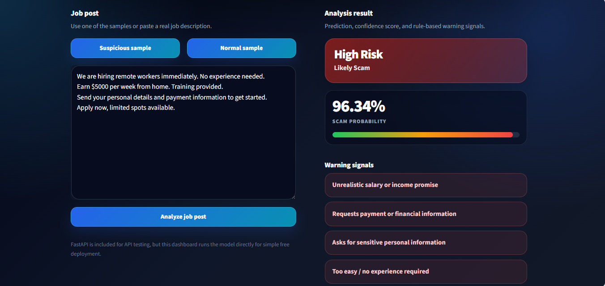
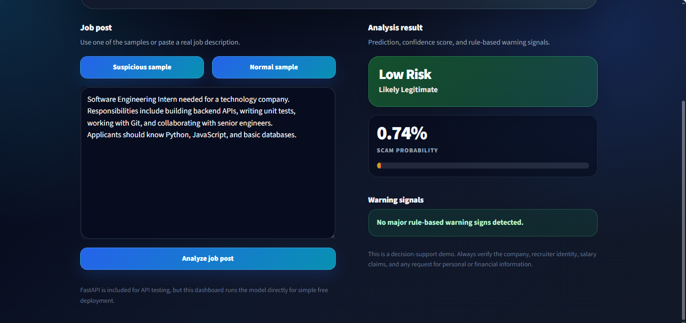

## Live Demo

Try the deployed app here:

[AI Job Scam Detector on Hugging Face Spaces](https://huggingface.co/spaces/Youssef-HC/ai-job-scam-detector)

Direct app link:

[Open the app directly](https://youssef-hc-ai-job-scam-detector.hf.space)

# JobShield AI — Keras NLP Job Scam Detector

JobShield AI is an end-to-end AI engineering project that detects scam-like job postings using a trained Keras NLP model. The app returns a scam probability, a risk tier, and rule-based warning signals that explain suspicious text patterns.

This project is designed to demonstrate model development, evaluation, threshold tuning, local inference, and model serving — not just a website connected to an external AI API.

## Demo Modes

### 1. Streamlit Dashboard

The Streamlit dashboard loads the trained model directly and does not require any paid API calls.

```bash
streamlit run app.py
```

### 2. FastAPI Model Server

The FastAPI backend is included to demonstrate model serving through an API.

```bash
uvicorn api.main:app --reload
```

Then open:

```text
http://127.0.0.1:8000/docs
```

## Features

- Keras BiLSTM NLP classifier
- TextVectorization-based preprocessing
- Class-imbalance handling
- Baseline ML model comparison documented in the notebook
- Threshold tuning for risk levels
- Rule-based warning-signal explanation
- Streamlit dashboard for local/demo use
- FastAPI `/predict` endpoint for model serving
- No paid AI API dependency

## Model Results

| Model | Accuracy | Precision | Recall | F1-score | ROC-AUC |
|---|---:|---:|---:|---:|---:|
| TF-IDF + Logistic Regression | 0.9701 | 0.6352 | 0.8960 | 0.7434 | 0.9831 |
| Keras BiLSTM, default threshold 0.50 | 0.9771 | 0.7078 | 0.8960 | 0.7908 | 0.9915 |
| Keras BiLSTM, tuned high-risk threshold 0.9345 | 0.9869 | 0.9315 | 0.7861 | 0.8527 | 0.9915 |

## Risk Interpretation

The deployed dashboard uses two thresholds:

| Scam Probability | Risk Level | Meaning |
|---:|---|---|
| `< 0.50` | Low Risk | Likely legitimate |
| `0.50 – 0.9345` | Medium Risk | Suspicious; review manually |
| `>= 0.9345` | High Risk | Likely scam |

## Example Output

Suspicious job post:

```json
{
  "prediction": "Likely Scam",
  "risk_level": "High Risk",
  "scam_probability": 0.9634,
  "warning_signs": [
    "Unrealistic salary or income promise",
    "Requests payment or financial information",
    "Asks for sensitive personal information",
    "Too easy / no experience required",
    "Urgency or pressure"
  ]
}
```

Normal job post:

```json
{
  "prediction": "Likely Legitimate",
  "risk_level": "Low Risk",
  "scam_probability": 0.0074,
  "warning_signs": []
}
```
## Demo Screenshots

### High Risk Prediction



### Low Risk Prediction



## Included Model Artifacts

Only the files needed for inference are committed:

```text
models/keras_job_scam_model.weights.h5
models/vectorizer_vocabulary.txt
models/model_config.json
models/threshold_config.json
```

The baseline `.pkl` model, raw dataset, virtual environment, caches, and temporary training outputs are intentionally excluded.

## Project Structure

```text
ai-job-scam-detector/
├── api/                    # FastAPI model-serving API
├── app/                    # Streamlit dashboard
├── data/                   # Dataset placeholder; raw CSV is ignored
├── models/                 # Required Keras inference artifacts only
├── notebooks/              # Data exploration and model training notebook
├── src/                    # Model loading, prediction, and warning-rule logic
├── app.py                  # Streamlit deployment entry point
├── requirements.txt        # Runtime/deployment dependencies
├── requirements-dev.txt    # Notebook/training dependencies
└── README.md
```

## Installation

Create and activate a virtual environment:

```bash
python -m venv venv
```

Windows PowerShell:

```powershell
venv\Scripts\activate
```

macOS/Linux:

```bash
source venv/bin/activate
```

Install runtime dependencies:

```bash
pip install -r requirements.txt
```

For notebook retraining, install development dependencies:

```bash
pip install -r requirements-dev.txt
```

## Run the Streamlit Dashboard

```bash
streamlit run app.py
```

The model is loaded only when the first analysis is requested, then cached by Streamlit.

## Run the FastAPI Server

```bash
uvicorn api.main:app --reload
```

Health check:

```text
GET http://127.0.0.1:8000/health
```

Prediction endpoint:

```text
POST http://127.0.0.1:8000/predict
```

Example request:

```json
{
  "job_text": "We are hiring remote workers immediately. No experience needed. Earn $5000 per week from home. Send your personal details and payment information to get started. Apply now."
}
```

## Dataset

Training used the `fake_job_postings.csv` dataset, commonly distributed as the Kaggle **Real or Fake Job Posting Prediction** dataset.

The raw CSV is not included in this repository because it is large. To retrain the notebook pipeline, download the dataset and place it here:

```text
data/fake_job_postings.csv
```

## Deployment Notes

This repository is prepared for Hugging Face Spaces using Streamlit. The deployment entry point is:

```text
app.py
```

The Streamlit app loads the Keras model directly, so a separate backend deployment is not required.

## Limitations

- The model is trained on one dataset and may not generalize to every region, language, or job platform.
- Rule-based warning signs are explainability aids, not full model explanations.
- This is a decision-support tool and should not replace manual verification.

## License

MIT License.
